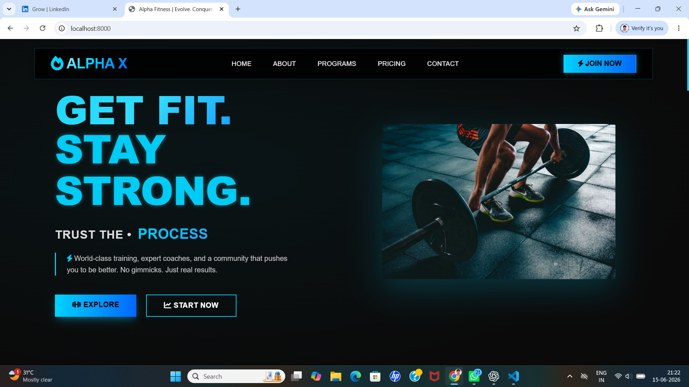
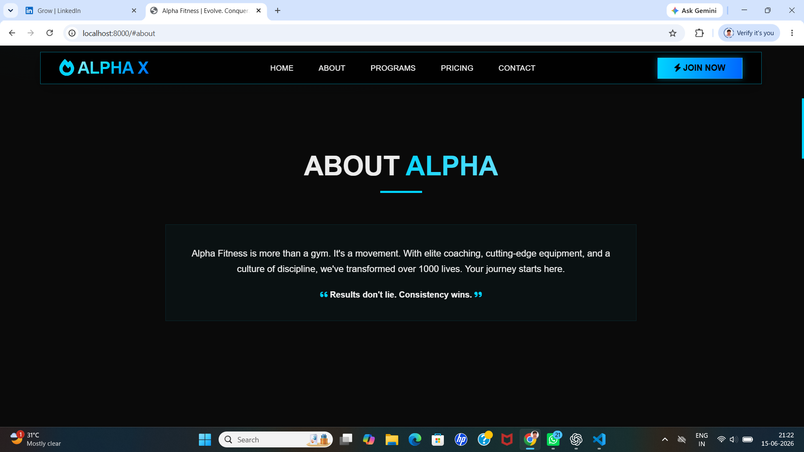
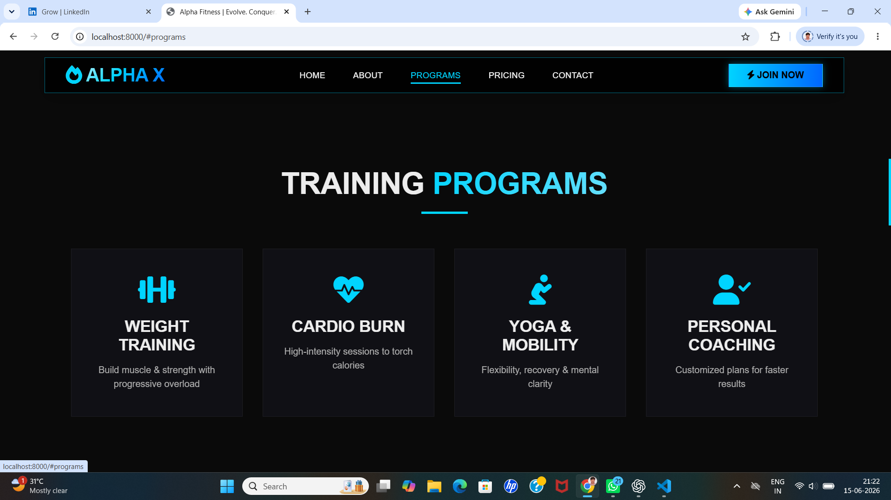
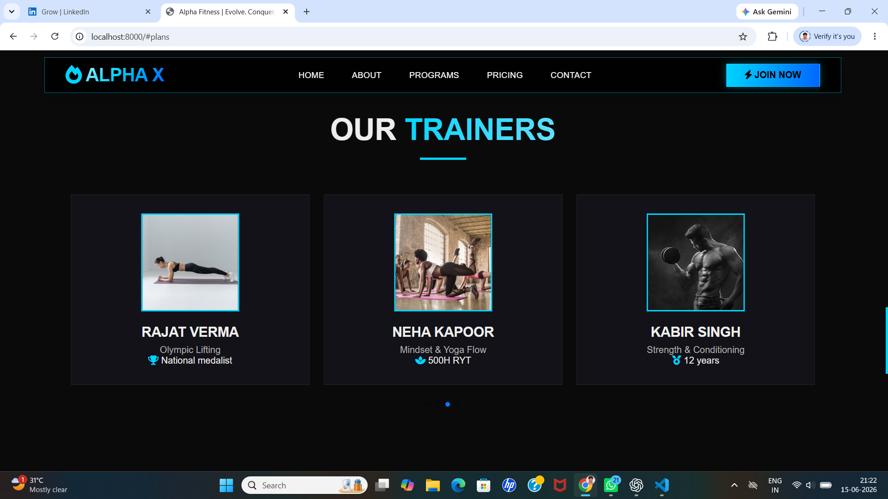
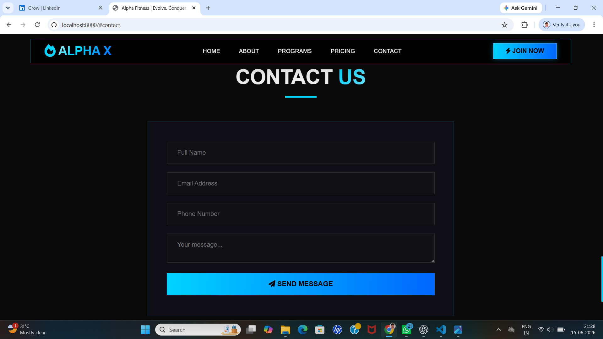

# Local Business Website

## Project Overview
This project is a professional website developed for a local business to enhance its online presence and provide customers with easy access to business information and services.

## Features
- Responsive Design
- Modern UI/UX Design
- About Section
- Programs Section
- Membership Plans
- Trainers Section
- Contact Section
- Mobile-Friendly Layout
- Clean Navigation

## Technologies Used
- HTML5
- CSS3
- JavaScript

## Live Demo
[Live Website Link]

## GitHub Repository
[Repository Link]

## Screenshots

### Home Page

### About Section

### Programs Section

### Membership Plans

### Trainers Section

### Contact Section

## Business Benefits
This website helps the business:
- Reach more customers online
- Improve credibility and professionalism
- Provide business information 24/7
- Increase customer engagement
- Strengthen brand presence

## Project Outcome
A fully responsive and user-friendly business website designed to support business growth and customer interaction.

## Pitch Explanation
This website was created to help the business establish a strong online presence. The responsive design, clear navigation, service information, membership plans, trainer profiles, and contact options make it easier for potential customers to learn about the business and get in touch. This can improve customer engagement, increase inquiries, and support business growth.

## Author
Laxmi Prasanna Mandala
